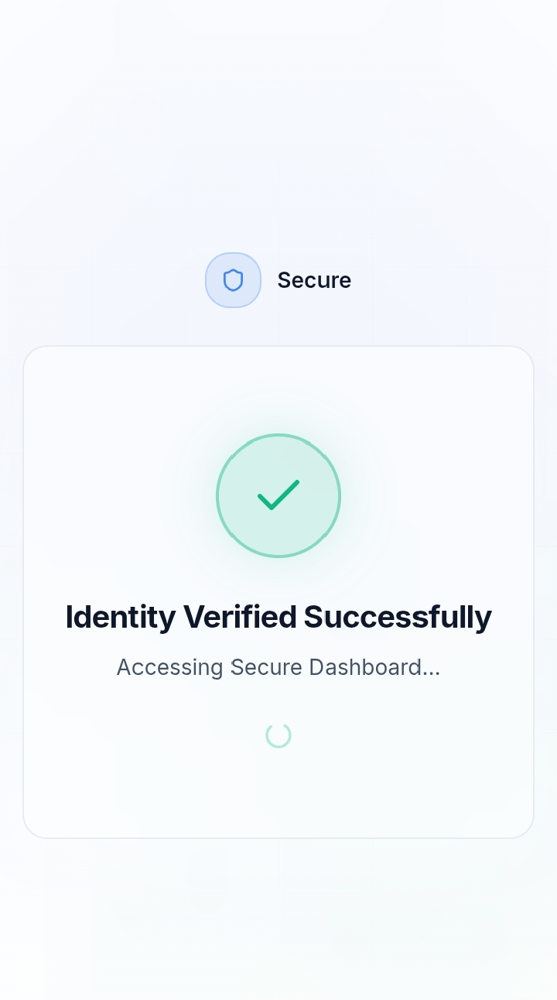
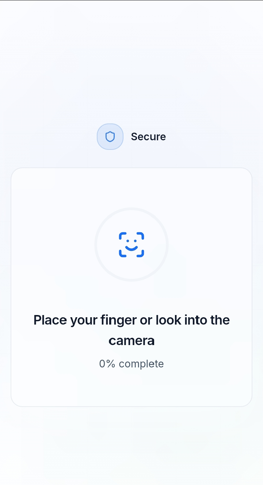
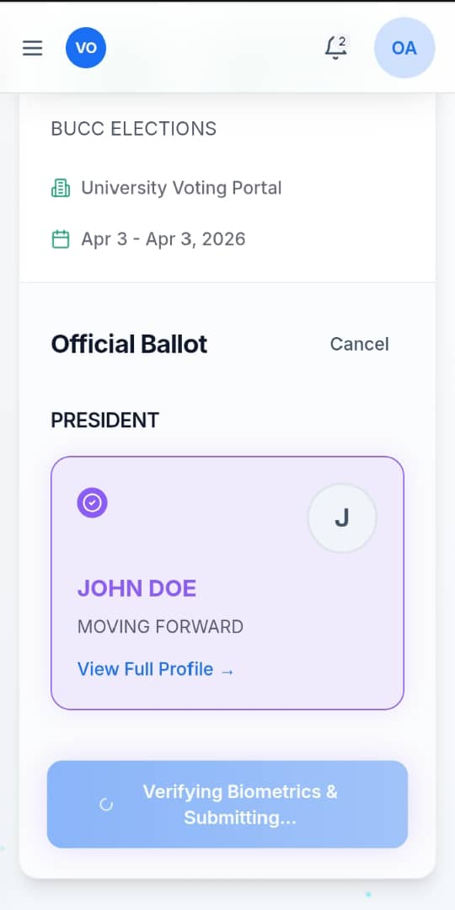
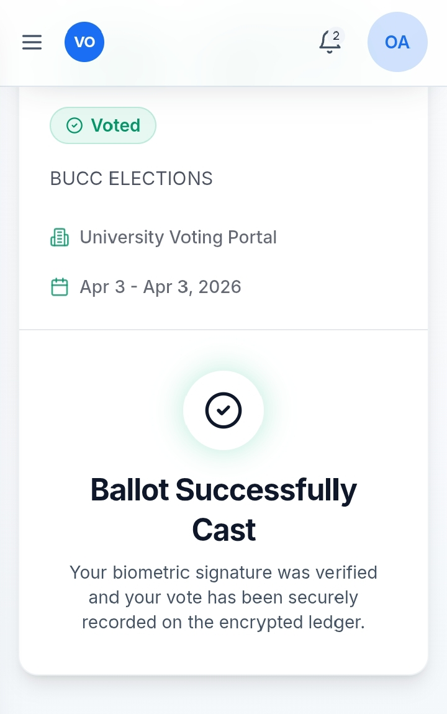
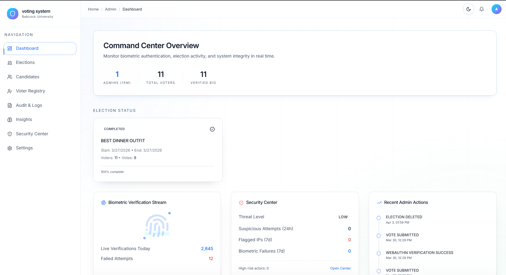

# Secure Biometric Online Voting System

A secure web-based voting platform designed for university elections, using **WebAuthn-based biometric authentication** to reduce impersonation, prevent duplicate voting, and improve trust in digital elections.

## Overview

Many institutional voting platforms still rely on weak authentication methods such as passwords, matriculation numbers, or email-only verification. These approaches make impersonation, credential sharing, and duplicate voting easier than they should be.

This project proposes a stronger alternative: a biometric-enabled online voting system that uses **device-level authentication** through **WebAuthn/FIDO2**. Instead of storing raw biometric data on the server, the system relies on the user’s device to handle biometric verification locally and return a cryptographic proof of identity.

The project was designed around the need for a **lightweight, secure, and practical e-voting solution** for university environments, with Babcock University used as the case study. fileciteturn0file0

## Problem Statement

Existing university election systems often suffer from:

- weak voter authentication
- voter impersonation and credential sharing
- risk of multiple voting
- poor transparency and low voter trust
- limited auditability and weak protection of election data

This project addresses those issues by combining biometric authentication, secure vote handling, and controlled result management in a single web platform. fileciteturn0file0

## Solution

The system provides a secure election workflow that allows eligible users to:

- register using institutional details
- authenticate with device biometrics through WebAuthn
- vote once per election
- submit votes securely
- allow administrators to manage elections and monitor progress
- compute and display results in real time for authorized roles

The design emphasizes **confidentiality, integrity, and availability**, using encryption, access control, audit logging, and modular architecture. fileciteturn0file0

## Key Features

- **Biometric login with WebAuthn** using device fingerprint or facial verification
- **Passwordless or reduced-password workflow** backed by public key cryptography
- **One-person, one-vote enforcement**
- **Role-based access control** for voters and administrators
- **Secure vote submission and storage**
- **Real-time result computation and visualization**
- **Audit trail and activity logging**
- **Responsive web interface** for desktop and mobile access
- **Fallback authentication path** for users without biometric support on their device fileciteturn0file0

## How It Works

1. A voter registers with institutional details.
2. The device creates a WebAuthn credential linked to the user.
3. During login or vote authorization, the device verifies the user biometrically.
4. The server validates the signed authentication response.
5. The voter accesses the ballot and submits one secure vote.
6. Votes are stored and counted securely, while administrators monitor election activity through a dashboard.

## Tech Stack

**Frontend**
- React.js
- Tailwind CSS

**Backend**
- NestJS
- Node.js
- TypeScript

**Database / Platform**
- Supabase
- PostgreSQL
- Prisma ORM

**Authentication / Security**
- WebAuthn (FIDO2)
- JWT for fallback flows
- AES-256 encryption
- SSL/TLS
- Role-Based Access Control (RBAC) fileciteturn0file0

## System Modules

### 1. Voter Module
Handles voter registration, authentication, ballot access, and vote submission.

### 2. Admin Module
Allows administrators to create elections, manage candidates, activate or deactivate voters, and oversee results.

### 3. Voting and Integrity Module
Ensures that each voter can vote only once and that submitted votes remain protected and verifiable.

### 4. Result Management Module
Aggregates results in real time and presents them to authorized users through dashboards and visual summaries. fileciteturn0file0

## Security Design

This project was built with security as a core requirement, not an afterthought.

### Security choices
- biometric verification is handled on the user’s device where possible
- raw biometric images are not required to be stored on the server
- vote data is encrypted in transit and at rest
- access to sensitive actions is restricted by role
- audit logs improve accountability and traceability
- the architecture follows the **CIA triad**:
  - **Confidentiality**: protect voter data and ballot privacy
  - **Integrity**: ensure votes are not altered after submission
  - **Availability**: keep the platform accessible during election periods fileciteturn0file0

## Architecture Summary

The system follows a layered web architecture:

- **Presentation Layer** – React frontend for voter and admin interactions
- **Application Layer** – NestJS backend for business logic, authentication, and vote handling
- **Data Layer** – PostgreSQL/Supabase for secure persistence and auditing
- **Hardware-backed authentication layer** – device biometrics via WebAuthn-compatible authenticators when available 

 

## Screenshots

**Voter Login / Biometric Prompt Flow**  
<p align="center">
  
  <span style="display:inline-block; width: 16px;"></span>
  
</p>

Biometric authentication is handled at the device level via WebAuthn.
For security reasons, the OS prevents capturing screenshots of the biometric prompt.

**Voting Dashboard / Ballot Page**  
<p align="center">
  
  <span style="display:inline-block; width: 16px;"></span>
  
</p>
Biometric authentication is handled at the device level via WebAuthn.
For security reasons, the OS prevents capturing screenshots of the biometric prompt.

Admin Dashboard (Web)


 <p align="center">
  
</p>
Real-time monitoring and control center for election management.

- Live election tracking and voter participation  
- Biometric verification monitoring  
- Security insights and audit logs  


## Testing

The system was tested using:

- unit testing
- integration testing
- functional testing
- user acceptance testing
- API validation using Postman and Swagger
- browser developer tools for frontend debugging and performance checks fileciteturn0file0

## Use Cases

The platform supports workflows such as:

- voter registration
- biometric login
- election participation
- secure vote casting
- candidate management
- election creation and control
- result viewing
- audit log review fileciteturn0file0

## Project Goals

The main goal of the project is to improve the **integrity, transparency, and accessibility** of university elections by building a secure biometric voting system capable of reducing unauthorized access, duplicate voting, and data tampering. fileciteturn0file0

## Limitations

Current limitations noted in the project include:

- support for a single election instance at a time
- limited multimodal biometric support in the current version
- testing performed in a simulated environment rather than full institutional deployment
- dependence on internet quality for access and performance fileciteturn0file0

## Future Improvements

- support multiple simultaneous elections
- expand multimodal biometric verification
- improve large-scale scalability testing
- integrate stronger device integrity checks
- enhance accessibility and low-bandwidth resilience

## Why This Project Matters

This project is not just a voting app. It is an attempt to solve a real trust problem in institutional elections by combining modern authentication standards with practical system design for university environments. It demonstrates applied work in:

- security engineering
- authentication design
- full-stack web development
- system architecture
- applied software engineering for civic/institutional technology

## Repository Structure

 

## Setup

```bash
# clone repo
git clone <your-repo-url>

# install frontend dependencies
cd client
npm install

# install backend dependencies
cd ../server
npm install

# run frontend
npm run dev

# run backend
npm run start:dev
```

## Author

Built as a final year software engineering project focused on secure digital voting for university elections.
